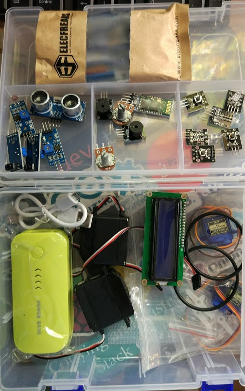

# Kit de montaje sencillo

Está pensado desde 5-6 primaria con actividades STEAM

Son componentes de 3 pines que se conectan directamente a una placa arduino con también 3 pines

## Componentes

|Componente|cantidad
|---|---
|**Sensores**||
|Shield Sensor v5|1
|Potenciómetro circular 10k|2
|Módulo sensor de luz LDR|2
|Módulo sensor siguelíneas|3
|Sensor ultrasonidos|1
|DS18B20 estanco|1
|TMP36|1
|Sensor atmosférico BME280|1
|Módulo humedad de suelo|1
|Módulo joystick|1
|DHT22|1
|**Motores y potencia**||
|Servomotor Rotación continua|2
|Servomotor Sg90|2
|Relé|1
|Mosfet IPRF520|1
|**Conectividad**||
|Módulo bluetooth|1
|Wifi ESP8266| 1
|LCD 16x2 I2C| 1
|**Conexionado**|
|Cables de 3 pines|15
|Cables de 4 pines|
|Módulo pulsador (botón grande)|3
|**Alimentación**||
|Power bank 4000|1
|**LEDS**|
|Módulo Leds de colores|3
|Módulo led RGB 5050|1
|Módulo láser|1
|**Varios**||
|Módulo Zumbador pasivo|1
|Mando a distancia IR con Modulo IR receptor|1
|Caja de plástico|1
